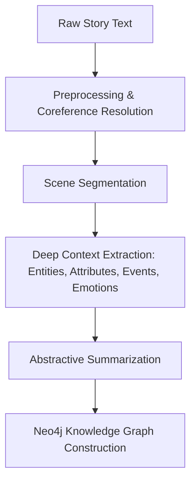

# 📖 Story2KG: From Narratives to Knowledge Graphs  

> Transform unstructured stories into structured, queryable **Knowledge Graphs** using cutting-edge NLP.  

  
  
  

---

## 🌟 Overview  

**Story2KG** is an **end-to-end Natural Language Processing (NLP) pipeline** that transforms raw narrative text into structured **Knowledge Graphs (KGs)**.  

Unlike prior works focusing on **individual subtasks** (NER, SRL, summarization), Story2KG provides a **unified framework** for:  

- 🧹 **Preprocessing & Coreference Resolution**  
- 📚 **Scene Segmentation**  
- 🔎 **Entity, Attribute, and Event Extraction**  
- 😃 **Emotion Classification**  
- ✍️ **Abstractive Summarization (BART/T5)**  
- 🌐 **Knowledge Graph Construction in Neo4j**  

The result is an **interactive, queryable graph** that captures characters, events, emotions, and relationships from stories.  

---

## 🚀 Key Features  

✅ **End-to-End Pipeline** – From raw text to KG.  
✅ **Narrative-Aware Design** – Handles stories, characters, events, and temporal flow.  
✅ **Hybrid NLP Models** – SpaCy, Hugging Face Transformers, AllenNLP.  
✅ **Graph Visualization** – Neo4j integration for querying and visualization.  
✅ **Modular Architecture** – Swap models (e.g., BART → T5).  
✅ **Applications** – Education, Digital Humanities, Explainable AI, Story Analytics.  

---

## 🏗️ Pipeline Architecture  



---

## 📂 Project Structure  

```
Story2KG/
│── notebooks            # Jupyter notebooks for experimentation
│── Architectures        # Adaptive + Hierarchical
│── requirements.txt     # Dependencies
│── License              # MIT License
│── README.md            # Project Documentation
```

---

## ⚙️ Installation  

### 1. Clone the Repository  
```bash
git clone https://github.com/yourusername/Story2KG.git
cd Story2KG
```

### 2. Create Virtual Environment  
```bash
python -m venv venv
source venv/bin/activate   # (Linux/Mac)
venv\Scripts\activate      # (Windows)
```

### 3. Install Dependencies  
```bash
pip install -r requirements.txt
```

### 4. Setup Neo4j  
- Install [Neo4j Desktop](https://neo4j.com/download/) or run a **Docker container**:  
```bash
docker run -d --name neo4j -p 7474:7474 -p 7687:7687 -e NEO4J_AUTH=neo4j/test neo4j:latest
```

---

## 🖥️ Usage  

### Run Pipeline on a Story  
```python
from story2kg import pipeline

story_text = """Once, a hare laughed at a tortoise for being slow..."""
kg = pipeline.run(story_text)

# Export to Neo4j
kg.export_to_neo4j(uri="bolt://localhost:7687", user="neo4j", password="test")
```

### Query Example (Cypher)  
```cypher
MATCH (c:Character)-[r]->(e:Event)
RETURN c.name, type(r), e.description;
```

---

## 📊 Evaluation  

| Component               | Precision | Recall | F1-Score |
|--------------------------|-----------|--------|----------|
| Entity Recognition       | 89.0%     | 91.2%  | 90.1%    |
| Attribute Detection      | 85.4%     | 83.7%  | 84.5%    |
| Emotion Classification   | 80.2%     | 78.9%  | 79.5%    |
| Knowledge Graph Completeness | –     | –      | 92.5%    |

---

## 🔮 Future Work  

- Expansion to **larger story corpora** (novels, folklore).  
- Integration with **LLMs (GPT, LLaMA)** for improved reasoning.  
- Support for **Temporal & Causal KGs**.  
- Advanced **narrative coherence evaluation metrics**.  

---

## 🎯 Applications  

📘 **Education** – Transform textbooks/fables into interactive graphs.  
📖 **Digital Humanities** – Analyze cultural narratives & folklore.  
🤖 **Explainable AI** – Human-readable narrative reasoning.  
📝 **Story Analytics** – Character profiling & plot analysis.  

---

## 👨‍💻 Contributors  

- **Dr. Mohan Allum** – Advisor  
- **Dasara Rajiv Kumar** – Co-Author  
- **Rohit Mukkala** – Co-Author  
- **Sujal Ghonmode** – Co-Author  

---

## 📜 License  

This project is licensed under the **MIT License**. See [LICENSE](LICENSE) for details.  
